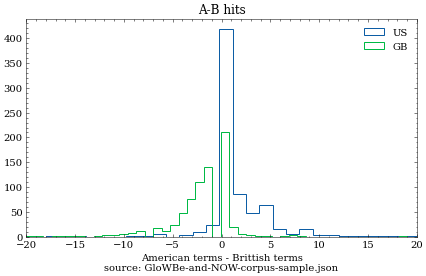
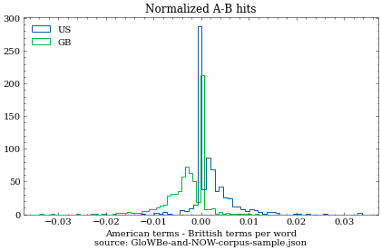

# task7
Variety identification

# Methodology:

Words indicative of either Brittish (B) or American (A) variety have been extracted from `varcon.txt`. If a word is different in B and A varieties, the brittish version is logged as indicative for B and american version is logged as indicative for A. But when a version could be either american or brittish with -ize spelling, it is not logged as indicative for any variety.

We discard all words that depend on context or part of speech. Alternative spelling and less frequently used words are also not used, so the only varcon tags used are A, B, and Z,  with no modifiers.

The framework currently has options to limit the minimal length of a word and to only include words with a `<verified>` tag.

# Example use:

```python
from utils import get_lexicon, preprocess, count_variants

lex = get_lexicon(min_length=3, only_verified=True)

# lex: {'abettor': 'A',
#  'abetter': 'B',
#  'abettors': 'A',
#  'abetters': 'B',
#  "abettor's": 'A',
#  "abetter's": 'B',
#  'abridgment': 'A',
#  'abridgement': 'B', ...

```

With the lexicon we can analyze a sample text like so:

```python
count_variants(sample, lex)

# ({'A': 6, 'B': 1},
#  {'airplanes': {'variant': 'A', 'count': 1},
#   'traveler': {'variant': 'A', 'count': 5},
#   'analyses': {'variant': 'B', 'count': 1}})

```

# Towards a proper classifier

Taja kindly prepared a few test files. So far the word counter worked without errors, but the output is convoluted. To classify if an instance is B or A the simplest thing we could do is subtracting B counts from A counts. If we do that on "GloWBe-and-NOW-corpus-sample.json", we get the following distribution:



It turns out that about 33% of all instances have no words detected, regardless of the `only_verified` setting. For these instances the classification is impossible. For the rest, however, we can see that the majority of the documents originating in the US have their A-B statistic heavily biased towards positive side of the histogram, which means they contain more A than B versions, and, mutatis mutandis, instances from GB are mostly found on the negative side of the histogram.

We can also look at normalized histograms, where the counts have been divided with the number of words in the instance text:



This gives us a sense of the magnitude of the variety differences we try to exploit here. On average we can use one word in 200, meaning that for short documents this is probably not the best way to go.