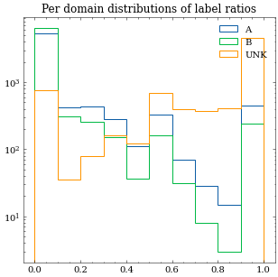
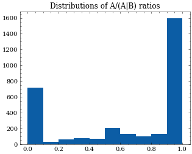

# task7
Variety identification

# Methodology:

Words indicative of either Brittish (B) or American (A) variety have been extracted from `varcon.txt`. If a word is different in B and A varieties, the brittish version is logged as indicative for B and american version is logged as indicative for A. But when a version could be either american or brittish with -ize spelling, it is not logged as indicative for any variety.

We discard all words that depend on context or part of speech. Alternative spelling and less frequently used words are also not used, so the only varcon tags used are A, B, and Z,  with no modifiers.

The framework currently has options to limit the minimal length of a word and to only include words with a `<verified>` tag.

# Example use:

```python
from utils import get_lexicon, preprocess, count_variants

lex = get_lexicon(min_length=3, only_verified=True)

# lex: {'abettor': 'A',
#  'abetter': 'B',
#  'abettors': 'A',
#  'abetters': 'B',
#  "abettor's": 'A',
#  "abetter's": 'B',
#  'abridgment': 'A',
#  'abridgement': 'B', ...

```

With the lexicon we can analyze a sample text like so:

```python
count_variants(sample, lex)

# ({'A': 6, 'B': 1},
#  {'airplanes': {'variant': 'A', 'count': 1},
#   'traveler': {'variant': 'A', 'count': 5},
#   'analyses': {'variant': 'B', 'count': 1}})

```

# Towards a proper classifier

Taja kindly prepared a few test files. So far the word counter worked without errors, but the output is convoluted. To classify if an instance is B or A the simplest thing we could do is subtracting B counts from A counts. If we do that on "GloWBe-and-NOW-corpus-sample.json", we get the following distribution:


It turns out that about 33% of all instances have no words detected, regardless of the `only_verified` setting. For these instances the classification is impossible. For the rest, however, we can see that the majority of the documents originating in the US have their A-B statistic heavily biased towards positive side of the histogram, which means they contain more A than B versions, and, mutatis mutandis, instances from GB are mostly found on the negative side of the histogram.

We can also look at normalized histograms, where the counts have been divided with the number of words in the instance text:


This gives us a sense of the magnitude of the variety differences we try to exploit here. On average we can use one word in 200, meaning that for short documents this is probably not the best way to go.

# Use on `hr21.tld_hr.good.lang_English.part01.prevert`

It was found that for 0.559 we have values of 0 for metric A-B, but this could be due to the fact that we found equal number of A and B varieties. If we look into only documents that have no words identified whatsoever, the ratio is 0.530.

If we include all words with length >= 3 (as opposed to only verified words), the metrics improve, but only slightly; the A-B metric is 0 in 0.536 of instances, and we get no words to classify in 0.503 of instances.

One thing that could rationalize this poor performance is the bilingual nature of the crawl data. We can assume that a part of the documents contains too few english words for successful classification. Most of the instances had only one word for which variant could be identified.

Distribution of A-B normalized metric looks like this:


Manual inspections yield these examples to be discussed:
* `{'colors': {'variant': 'A', 'count': 1}, 'colours': {'variant': 'B', 'count': 1}}`
* `{'center': {'variant': 'A', 'count': 1}, 'centre': {'variant': 'B', 'count': 1}}	`
* `{'kilometer': {'variant': 'A', 'count': 2}, 'centre': {'variant': 'B', 'count': 2}}`
* `{'colours': {'variant': 'B', 'count': 4}, 'paneling': {'variant': 'A', 'count': 6}, 'colour': {'variant': 'B', 'count': 2}, 'grey': {'variant': 'B', 'count': 2}, 'aluminum': {'variant': 'A', 'count': 1}, 'center': {'variant': 'A', 'count': 1}}`

In at least one manually inspected case the "text" was just a json dump (id 68695).

# Meeting notes 2022-02-18T14:10:51

* Prepare an output sample (N=O(1000)) for Taja's inspection (JSON, from Vit's data). 
* Nikola suggests 4 categories: A, B, mixed, and unknown. Taja agrees.
* mixed preliminary criterion: one variant more than two times more common than the other?
* Preprocessing: lowercase, take only alpha words.
* Research possible bias due to plural words being equal to B spelling (`A C: paralyzes / B Cv: paralyses; A B: paralyses | -- pl: paralysis`)
* Include `voc.tab` into the classifier (from the same zip folder as `varcon.txt`)


# Addendum 2022-02-24T09:18:22

To improve classifier's performance some errors were identified and corrected:
* `can - tin` pair was deleted due to frequent false detections.
* `cookie(s)` were deleted, but `biscuit(s)` were left.
* `analyses` and similar words were deleted, as it is impossible to discriminate B verb `to analyse` from A plural of `analysis`
* from `truck - lorry,van` *van* was deleted because it is also used in A variety
* `underground` and `tube` (subway,underground - tube)
* `car` (automobile - car)
* `rubber` (eraser - rubber, but rubber (material) is far more common use)
* `fall` (fall -autumn)
* `flat` (flat - puncture)
*  whole `motor - engine` pair
*  cross from `mad	angry,cross	` pair

Possible candidates for deletion:
* `holidays`
* `car` from `automobile - car` pair
* `gas` from `petrol - gas`  pair
* `diaper` from `diaper - nappy` pair

# Temporal performance

For a file of 3.1 GB I need about 1.2 minutes to parse it and calculate the statistics. The major part of this is needed for the parsing of the prevertical files and the classification is actually pretty fast (7 seconds).

On `GloWBe-and-NOW-corpus-sample.json` (kindly provided by Taja) the classifier outputs the following:

| country, detected variant | text |
|:--------------------------|-----:|
| ('GB', 'A')               |   51 |
| ('GB', 'B')               |  472 |
| ('GB', 'MIX')             |   77 |
| ('GB', 'UNK')             |  124 |
| ('US', 'A')               |  344 |
| ('US', 'B')               |   82 |
| ('US', 'MIX')             |  138 |
| ('US', 'UNK')             |  157 |

We can see that for documents originating in GB we indeed get about 90% A/B predictions in the correct category (`472/(472+51)`). For US documents the stats are a bit lower, a smidgeon over 80%. We can note that the `UNK` and `MIX` categories never outperform the presumed correct variety.

## Most common B words in US docs:

```
('car', 33),
 ('film', 19),
 ('shop', 14),
 ('holiday', 11),
 ('mobile', 11),
 ('films', 10),
 ('grey', 9),
 ('centre', 6),
 ('organisation', 6),
 ('behaviour', 6),
 ('shops', 6),
 ('travelled', 6),
 ('somewhere', 5),
 ('colour', 5),
 ('movie', 4),
 ```

 ## Most common A words in GB docs:

```
('gas', 59),
 ('hood', 31),
 ('movie', 23),
 ('store', 19),
 ('center', 15),
 ('attorney', 9),
 ('centers', 7),
 ('trailer', 7),
 ('favorite', 6),
 ('subway', 5),
 ('armour', 5),
 ('diaper', 5),
 ('film', 4),
 ('stores', 4),
 ('theater', 3),
 ```

# Addendum 2022-03-03T10:09:21

Line profiling hinted that in case the function would be pickled and used on individual texts the performance would be 
reduced due to its frequent vocabulary generation. I propose the variety be generated as follows:

```python
from utils import count_variants, get_lexicon, counts_to_category

text = "Cheerio, who amongst you would fancy a biscuit?"
lex = get_lexicon()
variant_detector_count = count_variants(text, lex)[0]

variety = counts_to_category(variant_detector_count)  # -> "B"
```

# Addendum 2022-03-03T14:29:42

After Taja's intervention voc.tab was corrected again. Now we take a look at words found in wrongly classified groups:

## American words in GB docs:

```('movie', 38),
 ('center', 28),
 ('favorite', 9),
 ('centers', 8),
 ('movies', 6),
 ('diaper', 5),
 ('harbor', 5),
 ('colors', 4),
 ('theater', 3),
 ('theatre', 3)
```

## Brittish words in US docs:

```
('grey', 9),
 ('centre', 7),
 ('travelled', 7),
 ('organisation', 6),
 ('behaviour', 6),
 ('amongst', 5),
 ('colour', 5),
 ('travellers', 4),
 ('organisations', 4),
 ('travelling', 4)
```

## Performance on labelled globwe+now corpus

As we can see, our interventions barely reduced the number of A variants in GB documents, but the number of B variants in US documents dropped for about a factor of 2. Due to the reduced number of keys we take into account, we increase the counts in `UNK` category, but this is in line with the mission directive of producing a good classifier that makes right decisions when it has enough data, albeit not every time.

|               | text |
|:--------------|-----:|
| ('GB', 'A')   |   50 |
| ('GB', 'B')   |  459 |
| ('GB', 'MIX') |   32 |
| ('GB', 'UNK') |  183 |
| ('US', 'A')   |  404 |
| ('US', 'B')   |   43 |
| ('US', 'MIX') |   25 |
| ('US', 'UNK') |  249 |

# Meeting notes 2022-03-04T14:46:47

Future actions:
* Check Varcon & Voc.tab licenses!
* ✓ Publish the ABC on macocu github repo. It can be pickled, but document all the changes to the varcon and voc.tab.
* Take parallel `tmx` data, concatenate paragraphs from the same document, perform document-level classification. See mail from LEO on 2022-03-01.
* Analyze results. How much UNK do we get? Are all the docs from the same domain of the same variant?


# Addendum 2022-03-07T13:59:21

Parsing `tmx` files is proving quite a challenge. After failures on en-sl files I tried en-mk due to their smaller size, but even so BeautifulSoup takes a long time to parse. Finally Taja gave me a neat advice: parse the tab separated text files instead. This worked.

Remark on input data: without much inspection I found a few examples of Montenegrin text where I expected English.

The data was grouped by urls and classified. The resulting distribution of character lengths looks like this:


The results of the classification is as follows:

| variant | counts |
|:--------|-------:|
| UNK     |  75111 |
| A       |  17974 |
| B       |   9647 |
| MIX     |   2302 |

I also extracted domains from urls. Now the only choice to make is visualization.

If I calculate ratios of american vs british variant document per domain, I can plot the following histogram:



If we discard UNK and MIX instances and look only the distribution of ratios of A to A/B, we get:


 

# Meeting notes 2022-03-08T14:17:33

* Look at domains with at least 3 A/B classifications
* Calculate the most prevalent one (if tied:random), apply to all docs in the domain
* Previous labels: true, new labels: predicted
* Calculate clf metrics 
* Calculate coverage: how many UNK docs can we "fix" with this method?